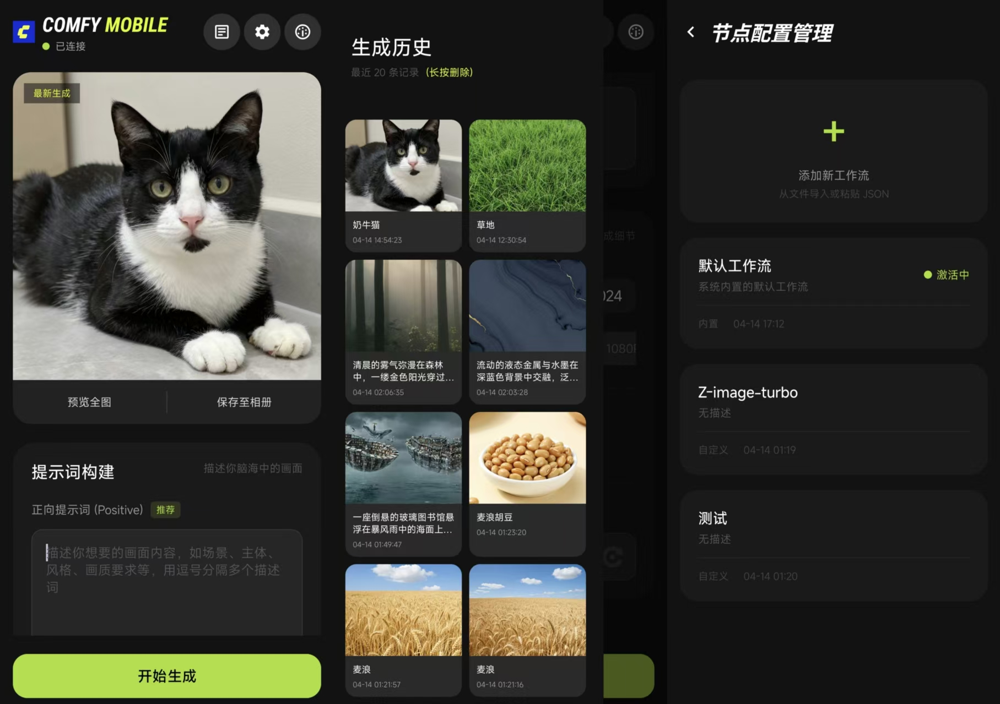

# ComfyUI Mobile

## 项目名称
**ComfyUI Mobile**

## 软件简介
ComfyUI Mobile 是基于  ComfyUI 的移动端应用，解决了移动端使用该项目生图的的体验问题。

## 主要功能
- 动态 UI 生成，实时渲染工作流节点
- 节点配置管理（新增、编辑、删除）
- 工作流可视化展示与交互
- 离线运行，支持本地保存与加载
- 主题与配色自定义

## 安装与运行
1. **APK 安装**：直接下载 `release`中下载APK并在 Android 设备上安装。
2. **Android Studio 运行**：在 Android Studio 中打开项目根目录 `demo`，同步 Gradle 后运行 `app` 模块。
**最低系统要求**：Android 6.0 (API 23) 及以上。

## 界面概览
主界面展示工作流概览与启动按钮，节点管理界面提供列表形式的节点配置编辑，设置界面支持主题切换与日志查看。

## 技术栈
- Android Studio
- Kotlin / Java
- AndroidX
- Material Components
- Gradle Kotlin DSL

## 贡献指南
- 在 Fork 后提交 Pull Request。
- 遵循项目代码风格，使用 Android Studio 自动格式化。

## 许可证
本项目采用 [MIT License](LICENSE) 开源，欢迎共同维护。

