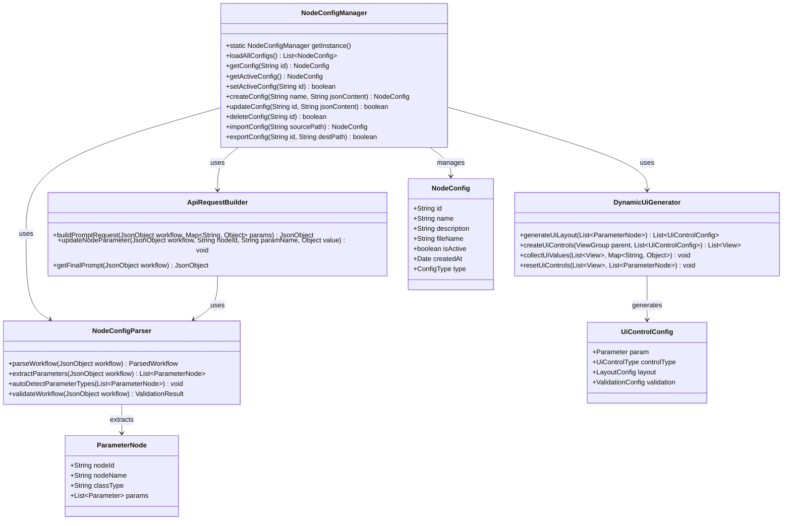
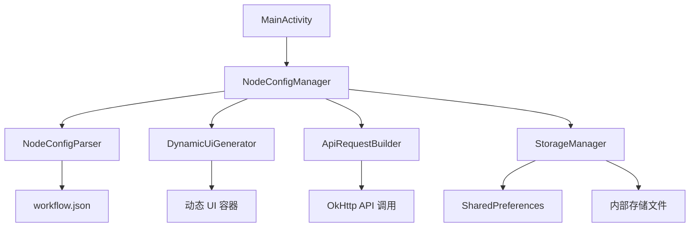
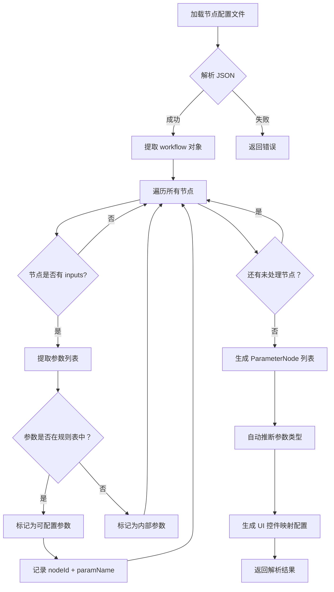
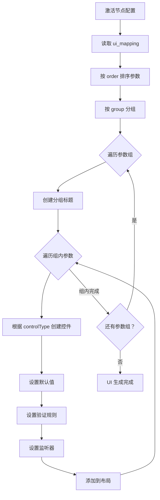
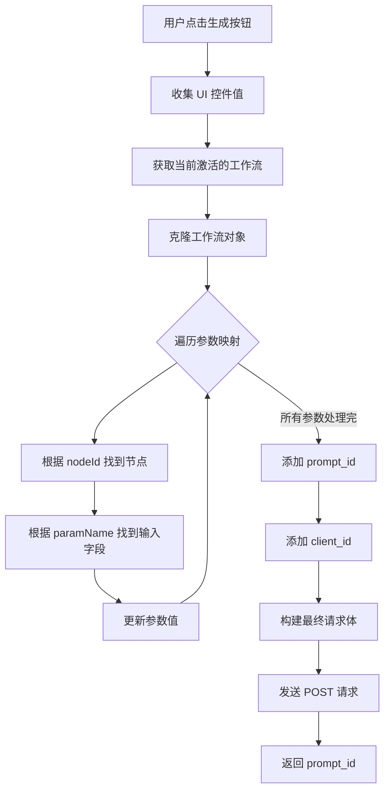

# ComfyUI 节点管理模块架构设计文档

## 1. 现有架构分析

### 1.1 当前实现状态

根据对现有代码的分析：

- **[`MainActivity.java`](app/src/main/java/com/example/demo/MainActivity.java)**:
  - 生图参数硬编码在 UI 控件中（Prompt、Seed、Steps、CFG、分辨率等）
  - 工作流模板从 [`workflow.json`](app/src/main/assets/workflow.json) 加载
  - API 请求构建采用硬编码节点 ID 方式（如节点 8 为正提示词，节点 3 为负提示词，节点 10 为 KSampler）
  - 使用 `SharedPreferences` 存储服务器 URL

- **[`workflow.json`](app/src/main/assets/workflow.json)**:
  - ComfyUI 标准工作流格式
  - 节点以 ID 为键，包含 `inputs`、`class_type`、`_meta` 字段
  - 当前为 Lumina 2 模型工作流

### 1.2 需要改进的点

1. 节点配置无法动态切换
2. UI 控件与具体工作流强耦合
3. API 请求构建逻辑硬编码，难以支持不同工作流

---

## 2. 数据模型设计

### 2.1 NodeConfig 数据类

```java
package com.example.demo.model;

import java.util.Date;

/**
 * 节点配置元数据
 */
public class NodeConfig {
    private String id;              // 唯一标识符（UUID）
    private String name;            // 配置名称
    private String description;     // 描述
    private String fileName;        // 对应的 JSON 文件名
    private boolean isActive;       // 是否当前激活
    private Date createdAt;         // 创建时间
    private Date modifiedAt;        // 修改时间
    private String thumbnailPath;   // 缩略图路径（可选）
    private ConfigType type;        // 配置类型

    public enum ConfigType {
        BUILTIN,        // 内置工作流
        USER_CREATED,   // 用户创建
        IMPORTED        // 导入的工作流
    }

    // 构造函数、Getter、Setter 省略
}
```

### 2.2 参数节点定义

```java
package com.example.demo.model;

import java.util.List;

/**
 * 工作流中的可配置参数节点
 */
public class ParameterNode {
    private String nodeId;            // 节点 ID（如 "8", "10"）
    private String nodeName;          // 节点显示名称
    private String classType;         // 节点类型（如 "CLIPTextEncode"）
    private List<Parameter> params;   // 参数列表

    public static class Parameter {
        private String name;          // 参数名（如 "text", "seed", "steps"）
        private ParameterType type;   // 参数类型
        private Object defaultValue;  // 默认值
        private String displayName;   // 显示名称
        private int order;            // 显示顺序

        public enum ParameterType {
            TEXT,           // 文本输入
            TEXT_AREA,      // 多行文本
            NUMBER,         // 数字输入
            INTEGER,        // 整数输入
            FLOAT,          // 浮点数输入
            SEED,           // 种子（特殊整数）
            BOOLEAN,        // 布尔值
            STRING_SELECT,  // 字符串下拉选择
            INT_SELECT,     // 整数下拉选择
            FILE_PATH,      // 文件路径
            LATENT_IMAGE    //  latent 图像参数
        }
    }
}
```

### 2.3 UI 控件映射配置

```java
package com.example.demo.model;

/**
 * UI 控件映射定义
 */
public class UiControlConfig {
    private ParameterNode.Parameter param;
    private UiControlType controlType;
    private LayoutConfig layout;
    private ValidationConfig validation;

    public enum UiControlType {
        EDIT_TEXT_SINGLE_LINE,    // 单行输入框
        EDIT_TEXT_MULTI_LINE,     // 多行输入框
        SEEK_BAR,                 // 滑动条
        NUMBER_PICKER,            // 数字选择器
        SPINNER,                  // 下拉选择
        SWITCH,                   // 开关
        SEED_INPUT,               // 种子输入（带随机按钮）
        RESOLUTION_INPUT          // 分辨率输入（宽高）
    }

    public static class LayoutConfig {
        private int priority;     // 显示优先级（0-100，数值越大越靠前）
        private boolean visible;  // 是否可见
        private String group;     // 分组名称（用于分组显示）
    }

    public static class ValidationConfig {
        private int minValue;     // 最小值
        private int maxValue;     // 最大值
        private int step;         // 步进
        private String pattern;   // 正则表达式验证
    }
}
```

---

## 3. 存储方案设计

### 3.1 存储结构

```
内部存储/
└── com.example.demo/
    └── files/
        └── node_configs/
            ├── builtin/              # 内置工作流（只读）
            │   └── default_workflow.json
            └── user/                 # 用户工作流
                ├── {uuid}_workflow.json
                ├── {uuid}_workflow.json
                └── ...
```

### 3.2 元数据存储（SharedPreferences）

```xml
<!-- comfy_node_prefs.xml -->
<map>
    <!-- 当前激活的配置 ID -->
    <string name="active_config_id">uuid-1234-5678</string>
    
    <!-- 配置列表（JSON 数组） -->
    <string name="config_list">[
        {"id":"uuid-1","name":"默认工作流","isActive":true,"type":"BUILTIN"},
        {"id":"uuid-2","name":"自定义 SDXL","isActive":false,"type":"USER_CREATED"}
    ]</string>
    
    <!-- UI 控件映射配置（按配置 ID 存储） -->
    <string name="ui_mapping_uuid-1">{"params":[...]}</string>
    <string name="ui_mapping_uuid-2">{"params":[...]}</string>
</map>
```

### 3.3 节点配置文件格式

```json
{
  "meta": {
    "id": "uuid-1234-5678",
    "name": "Lumina 2 文生图",
    "description": "基于 Lumina 2 模型的文本生成图像工作流",
    "version": "1.0",
    "author": "system",
    "type": "BUILTIN",
    "createdAt": "2024-01-01T00:00:00Z",
    "modifiedAt": "2024-01-01T00:00:00Z"
  },
  "ui_mapping": {
    "parameters": [
      {
        "nodeId": "8",
        "paramName": "text",
        "displayName": "正向提示词",
        "type": "TEXT_AREA",
        "defaultValue": "星际穿越，黑洞",
        "order": 1,
        "group": "提示词"
      },
      {
        "nodeId": "3",
        "paramName": "text",
        "displayName": "负向提示词",
        "type": "TEXT_AREA",
        "defaultValue": "低分辨率，模糊",
        "order": 2,
        "group": "提示词"
      },
      {
        "nodeId": "10",
        "paramName": "seed",
        "displayName": "随机种子",
        "type": "SEED",
        "defaultValue": 0,
        "order": 3,
        "group": "采样参数"
      },
      {
        "nodeId": "10",
        "paramName": "steps",
        "displayName": "采样步数",
        "type": "INTEGER",
        "defaultValue": 9,
        "minValue": 1,
        "maxValue": 100,
        "order": 4,
        "group": "采样参数"
      },
      {
        "nodeId": "10",
        "paramName": "cfg",
        "displayName": "CFG Scale",
        "type": "FLOAT",
        "defaultValue": 1.0,
        "minValue": 0.1,
        "maxValue": 20.0,
        "step": 0.1,
        "order": 5,
        "group": "采样参数"
      }
    ]
  },
  "workflow": {
    "3": { "inputs": { ... }, "class_type": "CLIPTextEncode", "_meta": { "title": "..." } },
    "8": { "inputs": { ... }, "class_type": "CLIPTextEncode", "_meta": { "title": "..." } },
    "10": { "inputs": { ... }, "class_type": "KSampler", "_meta": { "title": "..." } }
  }
}
```

---

## 4. 模块架构设计

### 4.1 类图



### 4.2 模块依赖关系



---

## 5. 关键算法与逻辑流程

### 5.1 参数节点识别规则

```java
package com.example.demo.parser;

/**
 * 参数节点识别规则定义
 */
public class ParameterDetectionRules {
    
    // 参数类型识别规则
    public static final Map<String, ParameterNode.ParameterType> PARAM_TYPE_RULES = Map.ofEntries(
        // 文本类参数
        Map.entry("text", ParameterNode.ParameterType.TEXT_AREA),
        Map.entry("positive", ParameterNode.ParameterType.TEXT_AREA),
        Map.entry("negative", ParameterNode.ParameterType.TEXT_AREA),
        
        // 种子参数
        Map.entry("seed", ParameterNode.ParameterType.SEED),
        Map.entry("noise_seed", ParameterNode.ParameterType.SEED),
        
        // 整数参数
        Map.entry("steps", ParameterNode.ParameterType.INTEGER),
        Map.entry("width", ParameterNode.ParameterType.INTEGER),
        Map.entry("height", ParameterNode.ParameterType.INTEGER),
        Map.entry("batch_size", ParameterNode.ParameterType.INTEGER),
        Map.entry("start_at_step", ParameterNode.ParameterType.INTEGER),
        Map.entry("end_at_step", ParameterNode.ParameterType.INTEGER),
        
        // 浮点数参数
        Map.entry("cfg", ParameterNode.ParameterType.FLOAT),
        Map.entry("denoise", ParameterNode.ParameterType.FLOAT),
        Map.entry("strength", ParameterNode.ParameterType.FLOAT),
        Map.entry("scale", ParameterNode.ParameterType.FLOAT),
        
        // 布尔参数
        Map.entry("return_mask", ParameterNode.ParameterType.BOOLEAN),
        Map.entry("add_mask", ParameterNode.ParameterType.BOOLEAN),
        
        // 下拉选择参数
        Map.entry("sampler_name", ParameterNode.ParameterType.STRING_SELECT),
        Map.entry("scheduler", ParameterNode.ParameterType.STRING_SELECT),
        Map.entry("order", ParameterNode.ParameterType.STRING_SELECT)
    );

    // 控件类型映射
    public static final Map<ParameterNode.ParameterType, UiControlConfig.UiControlType> CONTROL_TYPE_MAP = Map.ofEntries(
        Map.entry(ParameterNode.ParameterType.TEXT, UiControlConfig.UiControlType.EDIT_TEXT_SINGLE_LINE),
        Map.entry(ParameterNode.ParameterType.TEXT_AREA, UiControlConfig.UiControlType.EDIT_TEXT_MULTI_LINE),
        Map.entry(ParameterNode.ParameterType.INTEGER, UiControlConfig.UiControlType.SEEK_BAR),
        Map.entry(ParameterNode.ParameterType.FLOAT, UiControlConfig.UiControlType.SEEK_BAR),
        Map.entry(ParameterNode.ParameterType.SEED, UiControlConfig.UiControlType.SEED_INPUT),
        Map.entry(ParameterNode.ParameterType.BOOLEAN, UiControlConfig.UiControlType.SWITCH),
        Map.entry(ParameterNode.ParameterType.STRING_SELECT, UiControlConfig.UiControlType.SPINNER),
        Map.entry(ParameterNode.ParameterType.INT_SELECT, UiControlConfig.UiControlType.SPINNER)
    );
}
```

### 5.2 工作流解析流程



### 5.3 动态 UI 生成流程



### 5.4 API 请求构建流程



---

## 6. 核心接口定义

### 6.1 NodeConfigManager 接口

```java
package com.example.demo.manager;

import com.example.demo.model.NodeConfig;
import java.util.List;

public interface NodeConfigManager {
    
    /**
     * 获取单例实例
     */
    static NodeConfigManager getInstance() {
        return SingletonHolder.INSTANCE;
    }

    /**
     * 加载所有节点配置
     */
    List<NodeConfig> loadAllConfigs();

    /**
     * 根据 ID 获取配置
     */
    NodeConfig getConfig(String id);

    /**
     * 获取当前激活的配置
     */
    NodeConfig getActiveConfig();

    /**
     * 设置激活的配置
     */
    boolean setActiveConfig(String id);

    /**
     * 创建新配置
     */
    NodeConfig createConfig(String name, String jsonContent);

    /**
     * 更新配置
     */
    boolean updateConfig(String id, String jsonContent);

    /**
     * 删除配置
     */
    boolean deleteConfig(String id);

    /**
     * 从文件导入配置
     */
    NodeConfig importConfig(String sourcePath);

    /**
     * 导出配置到文件
     */
    boolean exportConfig(String id, String destPath);

    /**
     * 获取配置的原始 JSON 内容
     */
    String getConfigJsonContent(String id);
}
```

### 6.2 NodeConfigParser 接口

```java
package com.example.demo.parser;

import com.example.demo.model.ParameterNode;
import com.google.gson.JsonObject;
import java.util.List;

public interface NodeConfigParser {

    /**
     * 解析工作流 JSON
     */
    ParsedWorkflow parseWorkflow(JsonObject workflow);

    /**
     * 从工作流中提取可配置参数
     */
    List<ParameterNode> extractParameters(JsonObject workflow);

    /**
     * 自动检测参数类型
     */
    void autoDetectParameterTypes(List<ParameterNode> parameters);

    /**
     * 验证工作流有效性
     */
    ValidationResult validateWorkflow(JsonObject workflow);

    /**
     * 生成默认 UI 映射配置
     */
    String generateDefaultUiMapping(List<ParameterNode> parameters);
}
```

### 6.3 DynamicUiGenerator 接口

```java
package com.example.demo.ui;

import com.example.demo.model.UiControlConfig;
import android.view.View;
import android.view.ViewGroup;
import java.util.List;
import java.util.Map;

public interface DynamicUiGenerator {

    /**
     * 根据参数列表生成 UI 控件配置
     */
    List<UiControlConfig> generateUiLayout(List<ParameterNode> parameters);

    /**
     * 动态创建 UI 控件
     */
    List<View> createUiControls(ViewGroup parent, List<UiControlConfig> configs);

    /**
     * 从 UI 控件收集用户输入值
     */
    void collectUiValues(List<View> controls, Map<String, Object> values);

    /**
     * 重置 UI 控件到默认值
     */
    void resetUiControls(List<View> controls, List<ParameterNode> parameters);

    /**
     * 根据参数类型创建单个控件
     */
    View createControlForParameter(ViewGroup parent, UiControlConfig config);
}
```

### 6.4 ApiRequestBuilder 接口

```java
package com.example.demo.api;

import com.google.gson.JsonObject;
import java.util.Map;

public interface ApiRequestBuilder {

    /**
     * 构建生图请求体
     */
    JsonObject buildPromptRequest(JsonObject workflow, Map<String, Object> params);

    /**
     * 更新单个节点参数
     */
    void updateNodeParameter(JsonObject workflow, String nodeId, String paramName, Object value);

    /**
     * 获取最终的工作流 JSON
     */
    JsonObject getFinalPrompt(JsonObject workflow);

    /**
     * 验证参数完整性
     */
    boolean validateParameters(JsonObject workflow, Map<String, Object> params);
}
```

---

## 7. 界面架构设计

### 7.1 节点管理界面布局

```xml
<!-- res/layout/activity_node_manager.xml -->
<androidx.drawerlayout.widget.DrawerLayout ...>
    
    <!-- 主内容区 -->
    <LinearLayout ... android:orientation="vertical">
        
        <!-- 顶部工具栏 -->
        <com.google.android.material.appbar.MaterialToolbar
            android:id="@+id/toolbar"
            ... />
        
        <!-- 节点列表 -->
        <androidx.recyclerview.widget.RecyclerView
            android:id="@+id/rvNodeConfigs"
            ... />
        
        <!-- 浮动添加按钮 -->
        <com.google.android.material.floatingactionbutton.FloatingActionButton
            android:id="@+id/fabAdd"
            ... />
        
    </LinearLayout>
    
    <!-- 侧边抽屉 -->
    <com.google.android.material.navigation.NavigationView
        android:id="@+id/navigationView"
        ... />
        
</androidx.drawerlayout.widget.DrawerLayout>
```

### 7.2 节点列表项布局

```xml
<!-- res/layout/item_node_config.xml -->
<com.google.android.material.card.MaterialCardView ...>
    
    <LinearLayout ... android:orientation="vertical">
        
        <!-- 标题和激活状态 -->
        <LinearLayout ... android:orientation="horizontal">
            <TextView
                android:id="@+id/tvName"
                ... />
            <ImageView
                android:id="@+id/ivActiveIndicator"
                ... />
        </LinearLayout>
        
        <!-- 描述 -->
        <TextView
            android:id="@+id/tvDescription"
            ... />
        
        <!-- 元数据 -->
        <LinearLayout ...>
            <TextView
                android:id="@+id/tvType"
                ... />
            <TextView
                android:id="@+id/tvDate"
                ... />
        </LinearLayout>
        
    </LinearLayout>
    
</com.google.android.material.card.MaterialCardView>
```

### 7.3 节点上传/编辑对话框

```xml
<!-- res/layout/dialog_node_config_editor.xml -->
<com.google.android.material.dialog.MaterialAlertDialog ...>
    
    <ScrollView ...>
        <LinearLayout ... android:orientation="vertical">
            
            <!-- 名称输入 -->
            <com.google.android.material.textfield.TextInputLayout
                android:id="@+id/tilName"
                ...>
                <com.google.android.material.textfield.TextInputEditText
                    android:id="@+id/etName"
                    ... />
            </com.google.android.material.textfield.TextInputLayout>
            
            <!-- 描述输入 -->
            <com.google.android.material.textfield.TextInputLayout
                android:id="@+id/tilDescription"
                ...>
                <com.google.android.material.textfield.TextInputEditText
                    android:id="@+id/etDescription"
                    ... />
            </com.google.android.material.textfield.TextInputLayout>
            
            <!-- 上传方式选择 -->
            <RadioGroup
                android:id="@+id/rgUploadMethod"
                ...>
                <RadioButton android:text="从文件选择" />
                <RadioButton android:text="粘贴 JSON 内容" />
            </RadioGroup>
            
            <!-- 文件选择区域 -->
            <LinearLayout
                android:id="@+id/fileSelectionArea"
                ...>
                <Button
                    android:id="@+id/btnSelectFile"
                    android:text="选择 JSON 文件" />
                <TextView
                    android:id="@+id/tvSelectedFile"
                    ... />
            </LinearLayout>
            
            <!-- JSON 内容输入区域 -->
            <com.google.android.material.textfield.TextInputLayout
                android:id="@+id/jsonContentArea"
                ...>
                <com.google.android.material.textfield.TextInputEditText
                    android:id="@+id/etJsonContent"
                    android:hint="粘贴 JSON 内容"
                    android:inputType="textMultiLine"
                    ... />
            </com.google.android.material.textfield.TextInputLayout>
            
            <!-- 预览区域 -->
            <TextView
                android:id="@+id/tvPreview"
                android:text="检测到的参数：" />
            <RecyclerView
                android:id="@+id/rvPreviewParams"
                ... />
            
        </LinearLayout>
    </ScrollView>
    
</com.google.android.material.dialog.MaterialAlertDialog>
```

---

## 8. 实现建议与注意事项

### 8.1 实现优先级

1. **第一阶段：核心数据模型与存储**
   - 实现 `NodeConfig` 数据类
   - 实现 `StorageManager` 负责文件读写
   - 实现 `NodeConfigManager` 基础 CRUD

2. **第二阶段：解析与 UI 生成**
   - 实现 `NodeConfigParser` 参数提取
   - 实现 `DynamicUiGenerator` 基础控件生成
   - 在 MainActivity 中集成动态 UI

3. **第三阶段：API 请求构建**
   - 实现 `ApiRequestBuilder`
   - 替换原有硬编码请求构建逻辑

4. **第四阶段：节点管理界面**
   - 实现节点列表 Activity
   - 实现上传/编辑对话框
   - 实现激活/切换功能

### 8.2 向后兼容策略

```java
// 在 MainActivity 中添加兼容逻辑
private void initializeNodeConfig() {
    NodeConfigManager manager = NodeConfigManager.getInstance();
    
    // 检查是否有激活的配置
    NodeConfig activeConfig = manager.getActiveConfig();
    
    if (activeConfig == null) {
        // 没有激活配置，加载内置默认工作流
        activeConfig = manager.loadBuiltinConfig("default_workflow");
        if (activeConfig == null) {
            // 如果内置工作流也不存在，使用 assets 中的 workflow.json
            activeConfig = manager.createFromAssets("workflow.json");
        }
        manager.setActiveConfig(activeConfig.getId());
    }
    
    // 加载 UI 并应用配置
    loadDynamicUiForConfig(activeConfig);
}
```

### 8.3 注意事项

1. **JSON 验证**: 在保存用户配置前必须进行 JSON 格式验证和工作流结构验证
2. **权限处理**: 文件选择需要处理存储权限（Android 10+ 使用 Storage Access Framework）
3. **线程安全**: NodeConfigManager 需要保证线程安全，所有文件操作应在后台线程
4. **内存优化**: 大工作流 JSON 解析时注意内存占用，使用 Gson 的流式 API
5. **错误处理**: 提供友好的错误提示，如工作流无效、参数缺失等
6. **备份机制**: 定期备份用户配置，防止数据丢失

### 8.4 依赖建议

在 `build.gradle.kts` 中添加：

```kotlin
dependencies {
    // Gson 用于 JSON 处理
    implementation("com.google.code.gson:gson:2.10.1")
    
    // Room 数据库（可选，如果选择使用 Room 而非 SharedPreferences）
    implementation("androidx.room:room-runtime:2.6.1")
    implementation("androidx.room:room-ktx:2.6.1")
    
    // Material Design 组件
    implementation("com.google.android.material:material:1.11.0")
    
    // RecyclerView
    implementation("androidx.recyclerview:recyclerview:1.3.2")
}
```

---

## 9. 总结

本架构设计提供了完整的 ComfyUI 节点管理模块解决方案：

1. **数据模型**: 清晰的 `NodeConfig`、`ParameterNode`、`UiControlConfig` 分层
2. **存储方案**: SharedPreferences 存储元数据 + 内部存储文件存储内容
3. **核心模块**: `NodeConfigManager`、`NodeConfigParser`、`DynamicUiGenerator`、`ApiRequestBuilder`
4. **动态 UI**: 基于参数类型自动映射到合适的 Android 控件
5. **向后兼容**: 保留内置工作流作为默认选项

该设计具有良好的扩展性，未来可以支持：
- 节点配置模板市场
- 配置导入/导出分享
- 参数预设管理
- 工作流可视化编辑器
